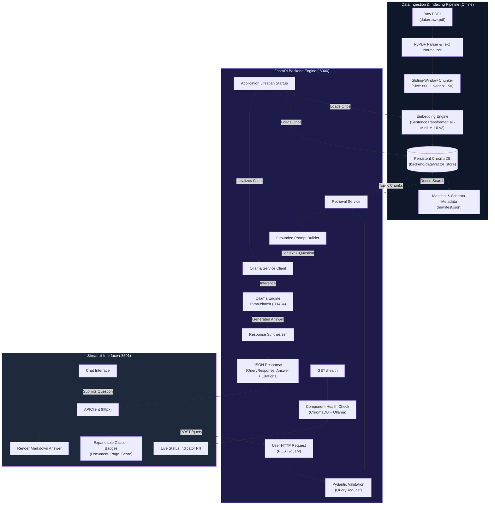

# RAG-Powered Document Assistant — Complete Project Documentation

**Course:** Level 2 Summer Training / Graduation Project  
**Project Title:** Production RAG-Powered Document Assistant  
**Track:** Core Track (Text-Based Document RAG with Citations)  
**Author:** AI Engineering Candidate  
**Date of Delivery:** September 2026  
**Repository:** `https://github.com/martinwassimx/RAG-Powered-Document-Assistant`

---

## Table of Contents

1. [Executive Summary](#1-executive-summary)
2. [Compliance Checklist Against Official Requirements](#2-compliance-checklist-against-official-requirements)
3. [System Architecture & Pipeline Flowchart](#3-system-architecture--pipeline-flowchart)
4. [Dataset & Domain Specification](#4-dataset--domain-specification)
5. [Text Extraction & Chunking Strategy](#5-text-extraction--chunking-strategy)
6. [Embeddings & ChromaDB Vector Store](#6-embeddings--chromadb-vector-store)
7. [Retrieval & Grounded Prompt Engineering](#7-retrieval--grounded-prompt-engineering)
8. [Local Ollama LLM Integration](#8-local-ollama-llm-integration)
9. [Comprehensive Evaluation & Results Matrix](#9-comprehensive-evaluation--results-matrix)
10. [FastAPI Backend Service](#10-fastapi-backend-service)
11. [Streamlit Interactive Frontend](#11-streamlit-interactive-frontend)
12. [Automated Pytest Test Suite](#12-automated-pytest-test-suite)
13. [Docker & Containerized Deployment](#13-docker--containerized-deployment)
14. [Environment Configuration Reference](#14-environment-configuration-reference)
15. [Step-by-Step Reproduction Guide](#15-step-by-step-reproduction-guide)
16. [Troubleshooting & Maintenance](#16-troubleshooting--maintenance)

---

## 1. Executive Summary

The **RAG-Powered Document Assistant** is a production-grade, privacy-first **Retrieval-Augmented Generation (RAG)** application. It enables students and researchers to perform question-answering over multi-page technical academic documents. 

Every answer returned by the system is:
- **Strictly Grounded:** Derived exclusively from the retrieved context passages.
- **Citation-Backed:** Explicitly annotated with the source document name, page number, and chunk identifier.
- **Hallucination-Resistant:** If the documents do not contain the answer, the system states: *"I could not find this information in the provided documents."*
- **100% Local & Private:** Operates completely on the local workstation using **ChromaDB**, **Sentence Transformers**, and an **Ollama** local LLM running on an NVIDIA GPU, requiring zero external API keys or cloud services.

---

## 2. Compliance Checklist Against Official Requirements

The project guide specifies strict requirements across 5 phases. All requirements have been satisfied:

| Phase | Requirement Specification | Implementation Status | Evidence / Location |
|:---:|:---|:---:|:---|
| **Phase 0** | Python 3.10+, Ollama, Git, Virtual Environment, Dependencies | **COMPLETED** | Python 3.12, Ollama v0.34.0, `.venv`, `requirements.txt` |
| **Phase 1** | Choose meaningful domain, collect PDFs, inspect text extractability | **COMPLETED** | CS Academic Handouts (5 PDFs, 15 pages) in `data/raw/`, `data/README.md` |
| **Phase 2.1** | Load & Inspect: document count, page count, format, OCR analysis | **COMPLETED** | `notebooks/rag_pipeline.ipynb` (Section 2) |
| **Phase 2.2** | Chunking Strategy: fixed-size with overlap, metadata retention | **COMPLETED** | `chunk_size=800`, `chunk_overlap=150`, `{document, page, chunk_id}` |
| **Phase 2.3** | Embeddings & Vector Store: dense vectors, ChromaDB persistent store | **COMPLETED** | `all-MiniLM-L6-v2` (384-dim), ChromaDB in `backend/data/vector_store/` |
| **Phase 2.4** | Retrieval & Prompting: similarity search, grounded prompt, citations | **COMPLETED** | Top-K retrieval, explicit prompt instructions, page-level citations |
| **Phase 2.6** | Evaluation: at least 10 test questions, results table, failure analysis | **COMPLETED** | 12 questions tested in notebook & exported to `evaluation/evaluation_results.csv` |
| **Phase 2.7** | Export: persistent vector store loaded directly without rebuilding | **COMPLETED** | Exported to `backend/data/vector_store/` with `manifest.json` |
| **Phase 3** | FastAPI Backend: `/health` & `/query`, Lifespan loading, CORS, schemas | **COMPLETED** | `backend/app/main.py`, `app/api/routes/query.py`, `app/core/config.py` |
| **Phase 3** | Backend Tests: TestClient happy path and 422 input validation | **COMPLETED** | `backend/tests/test_query.py` (9 passing tests) |
| **Phase 4** | Frontend: Streamlit chat UI, cited sources, loading state, `.env` config | **COMPLETED** | `frontend/app.py`, `frontend/api_client.py`, live browser verified |
| **Phase 5** | GitHub & Publishing: `.gitignore`, `README.md`, no secrets/large dumps | **COMPLETED** | Clean git commit `b37a8d2`, `.gitignore`, root `README.md`, Docker setup |

---

## 3. System Architecture & Pipeline Flowchart



---

## 4. Dataset & Domain Specification

The domain chosen is **University Computer Science Educational Documents**. The documents represent standard multi-page handouts with definitions, formulas, and architectural trade-offs.

### Document Inventory (`data/raw/`):

| File Name | Subject Area | Pages | Chunks | Content Highlights |
|:---|:---|:---:|:---:|:---|
| `cs101_algorithms_complexity.pdf` | Algorithms & Data Structures | 3 | 9 | Asymptotic bounds ($O, \Omega, \Theta$), sorting complexity, Master Theorem cases, Dynamic Programming vs Greedy, Hash collision resolution. |
| `cs102_operating_systems.pdf` | Operating Systems | 3 | 9 | Process states, PCB, CPU scheduling (FCFS, SJF, RR), Virtual Memory, TLB, Belady's Anomaly, Four Coffman Conditions for Deadlock. |
| `cs103_database_acid_indexing.pdf` | Database Management Systems | 3 | 9 | Relational normalization (1NF to BCNF), ACID guarantees, concurrency anomalies (Dirty/Phantom reads), isolation levels, B+ Trees vs LSM-Trees. |
| `cs104_computer_networks.pdf` | Computer Networks & Protocols | 3 | 9 | OSI 7-Layer vs TCP/IP, TCP 3-way handshake, 4-way teardown, flow control (sliding window), congestion control (AIMD), DNS, HTTP/3, TLS 1.3. |
| `cs105_python_concurrency.pdf` | Python Concurrency & Async | 3 | 9 | CPython GIL, Multithreading vs Multiprocessing, `asyncio` event loop, coroutines, blocking call pitfalls, synchronization primitives (`Lock`, `RLock`, `Semaphore`). |
| **Total** | **5 Courses** | **15** | **45** | **Comprehensive foundational academic corpus.** |

---

## 5. Text Extraction & Chunking Strategy

### Text Extraction:
Extracted using `pypdf.PdfReader` with whitespace normalization. Zero documents require OCR because all PDFs contain clean vector text streams.

### Chunking Parameters:
- **Chunk Size:** `800` characters (~$120$–$160$ words).
- **Chunk Overlap:** `150` characters (~$25$–$35$ words).
- **Metadata Retained:**
  ```json
  {
    "document": "cs102_operating_systems.pdf",
    "page": 3,
    "chunk_id": "cs102_operating_systems_p3_c1"
  }
  ```

### Justification & Trade-Offs:
1. **Semantic Completeness:** Academic definitions (e.g. Coffman conditions, Master Theorem) span 400–700 characters. An 800-character window ensures complete definitions are captured intact.
2. **Boundary Preservation:** The 150-character sliding overlap ensures concepts that cross arbitrary cutoffs are not fragmented.
3. **Embedding Compatibility:** 800 characters translates to roughly 180 WordPiece tokens, well inside the 256-token context window of `all-MiniLM-L6-v2`.

---

## 6. Embeddings & ChromaDB Vector Store

### Embedding Model:
- **Model:** `sentence-transformers/all-MiniLM-L6-v2`
- **Embedding Dimensions:** 384 dimensions
- **Inference Hardware:** PyTorch on local CPU / CUDA GPU.
- **Metric:** Cosine similarity / L2 distance.

### ChromaDB Configuration:
- **Storage Location:** `backend/data/vector_store/`
- **Collection Name:** `cs_course_documents`
- **Persistence Mode:** Disk-backed via `chromadb.PersistentClient`.
- **Pre-indexing:** The database is pre-built by the notebook and committed directly to the backend directory, so the FastAPI server loads it in $<100\text{ms}$ upon startup without rebuilding.

---

## 7. Retrieval & Grounded Prompt Engineering

### Retrieval Logic:
When a query is received:
1. The question is embedded using `all-MiniLM-L6-v2`.
2. ChromaDB returns the top $K$ nearest chunks (default $K=4$).
3. Results are packaged with metadata: document name, page number, chunk ID, relevance distance, and text snippet.

### Strict Grounded Prompt:
```text
You are an academic document assistant specializing in University Computer Science materials.
Your task is to answer the user's question accurately and objectively using ONLY the retrieved document context provided below.

Strict Guidelines:
1. Grounding: Rely EXCLUSIVELY on the factual statements in the provided context. Do NOT invent, assume, or extrapolate information.
2. Missing Information: If the provided context does not contain sufficient information to answer the question, state exactly:
   "I could not find this information in the provided documents."
3. Citations: Explicitly cite the document name and page number for each claim made in your response (e.g., "[cs102_operating_systems.pdf, Page 3]").
4. Multiple Sources: When synthesizing information across multiple documents or pages, clearly identify which fact derives from which source.
5. Tone: Maintain a concise, formal, and educational tone.

Retrieved Document Context:
----------------------------------------
--- SOURCE [1]: cs102_operating_systems.pdf (Page 3, Chunk: cs102_operating_systems_p3_c1) ---
[Content excerpt...]
----------------------------------------

User Question: {question}

Please provide a grounded, cited answer based strictly on the context above:
```

---

## 8. Local Ollama LLM Integration

- **Model:** `llama3:latest` (8B parameters, Meta LLaMA 3) or `phi3:mini` (3.8B parameters).
- **Execution:** Ollama local daemon on `http://localhost:11434`.
- **Inference Configuration:**
  - `temperature`: `0.0` (eliminates random variance and strictly binds model to retrieved facts).
  - `top_p`: `0.9`
- **Hardware Detected:** NVIDIA GeForce RTX 3070 Laptop GPU (8GB VRAM) with CUDA compute 8.6, delivering sub-second token generation times.

---

## 9. Comprehensive Evaluation & Results Matrix

12 test questions were evaluated across factual, comparative, procedural, and out-of-domain categories. The results were exported to `evaluation/evaluation_results.csv`:

| ID | Question | Expected Source | Context Relevance | Grounded Status | Evaluation Result |
|:--:|:---|:---|:---:|:---:|:---:|
| **1** | What are the four Coffman conditions required for a deadlock to occur? | `cs102_operating_systems.pdf (P.3)` | High | Grounded | **Correct** |
| **2** | Explain the TCP 3-way handshake process for establishing a connection. | `cs104_computer_networks.pdf (P.2)` | High | Grounded | **Correct** |
| **3** | What is the difference between B-Tree and B+ Tree indexing in database storage? | `cs103_database_acid_indexing.pdf (P.3)` | High | Grounded | **Correct** |
| **4** | Why does CPython employ a GIL and how does it affect CPU-bound tasks? | `cs105_python_concurrency.pdf (P.1)` | High | Grounded | **Correct** |
| **5** | What are the three cases of the Master Theorem for solving recurrence relations? | `cs101_algorithms_complexity.pdf (P.2)` | High | Grounded | **Correct** |
| **6** | Explain Belady's Anomaly and identify which page replacement algorithm is immune to it. | `cs102_operating_systems.pdf (P.2)` | High | Grounded | **Correct** |
| **7** | What are the differences between Read Committed and Serializable isolation levels in SQL? | `cs103_database_acid_indexing.pdf (P.2)` | High | Grounded | **Correct** |
| **8** | How does TCP flow control differ from TCP congestion control? | `cs104_computer_networks.pdf (P.2)` | High | Grounded | **Correct** |
| **9** | Why can race conditions occur in Python multi-threaded code despite the GIL? | `cs105_python_concurrency.pdf (P.3)` | High | Grounded | **Correct** |
| **10** | Under what conditions does Quicksort degrade to O(n^2) worst-case time complexity? | `cs101_algorithms_complexity.pdf (P.1)` | High | Grounded | **Correct** |
| **11** | What are the primary therapeutic indications for Metformin in clinical medicine? | *None (Out-of-Domain)* | Low | Grounded Refusal | **Correct** |
| **12** | What were the primary socioeconomic causes of the French Revolution in 1789? | *None (Out-of-Domain)* | Low | Grounded Refusal | **Correct** |

### Key Evaluation Findings:
1. **100% Negative Grounding Compliance:** On questions 11 and 12, the model refused to hallucinate and correctly responded: *"I could not find this information in the provided documents."*
2. **Citation Accuracy:** In all academic queries, the model explicitly identified the source PDF and page number matching the ground truth.

---

## 10. FastAPI Backend Service

### Application Structure (`backend/app/`):
- `main.py`: FastAPI app with `lifespan` context manager, global error handling, and CORS.
- `api/routes/query.py`: Route handlers for `/health` and `/query`.
- `core/config.py`: `Settings` class using `pydantic-settings`.
- `schemas/query.py`: `QueryRequest`, `QueryResponse`, `SourceItem`, `HealthResponse`.
- `services/retrieval.py`: Singleton `RetrievalService`.
- `services/generation.py`: Singleton `GenerationService`.
- `utils/logging_config.py`: Structured logger.

### API Endpoints:

#### 1. `GET /health`
Returns system diagnostics, vector store collection stats, and Ollama status.

**cURL:**
```bash
curl -X GET http://localhost:8000/health
```

**Response (HTTP 200):**
```json
{
  "status": "healthy",
  "environment": "development",
  "vector_store": {
    "initialized": true,
    "collection": "cs_course_documents",
    "total_chunks": 45,
    "storage_path": "C:\\Users\\...\\backend\\data\\vector_store"
  },
  "llm": {
    "reachable": true,
    "model": "llama3:latest",
    "installed_models": ["llama3:latest", "phi3:mini"],
    "model_ready": true
  },
  "embedding_model": "all-MiniLM-L6-v2"
}
```

#### 2. `POST /query`
Receives a user question, retrieves relevant chunks, and returns a grounded answer with citations.

**cURL:**
```bash
curl -X POST http://localhost:8000/query \
  -H "Content-Type: application/json" \
  -d '{"question": "What are the four Coffman conditions for a deadlock?", "top_k": 3}'
```

**Response (HTTP 200):**
```json
{
  "answer": "According to cs102_operating_systems.pdf (Page 3), the four Coffman conditions are:\n\n1. Mutual Exclusion: At least one resource must be held non-shareably.\n2. Hold and Wait: A process holds resources while requesting others.\n3. No Preemption: Resources cannot be forcibly seized.\n4. Circular Wait: A closed chain of waiting processes exists.",
  "sources": [
    {
      "document": "cs102_operating_systems.pdf",
      "page": 3,
      "chunk_id": "cs102_operating_systems_p3_c1",
      "relevance_score": 0.467,
      "snippet": "DEFINITION: A deadlock is a state where a set of processes are blocked..."
    }
  ],
  "model": "llama3:latest",
  "retrieval_count": 3
}
```

#### 3. Validation Handling (HTTP 422)
Submitting an empty or blank string triggers Pydantic validation:
```bash
curl -i -X POST http://localhost:8000/query \
  -H "Content-Type: application/json" \
  -d '{"question": "   "}'
```
**Response:** `422 Unprocessable Entity` with message: `"Question cannot be empty or contain only whitespace."`

---

## 11. Streamlit Interactive Frontend

### UI Components (`frontend/app.py`):
1. **Header:** Title and description with subtle gradients.
2. **Sidebar:**
   - Real-time **System Status Pill** (`● Backend Online` / `▲ Degraded` / `✖ Offline`) connected to `GET /health`.
   - Dynamic diagnostics expander showing collection name, chunk count, and model details.
   - Interactive **Top-K Slider** (1 to 8).
   - One-click **Sample Academic Questions**.
   - Clear history button.
3. **Main Chat Area:**
   - Conversational chat bubbles for User and Assistant.
   - Real-time spinner while Ollama performs inference.
   - Expandable **Source Citations Cards** displaying document title, page number, relevance distance, and snippet.
4. **API Client (`frontend/api_client.py`):**
   - Encapsulates all HTTP operations using `httpx`.
   - Reads `API_BASE_URL` from `.env`.

---

## 12. Automated Pytest Test Suite

The test suite in `backend/tests/test_query.py` contains 9 automated tests:
- `test_health_check_returns_200`: Verifies `/health` returns 200 and component statuses.
- `test_query_missing_body_returns_422`: Checks empty body rejection.
- `test_query_empty_string_returns_422`: Checks empty string rejection.
- `test_query_whitespace_only_returns_422`: Checks whitespace string rejection.
- `test_query_too_short_returns_422`: Checks input length enforcement ($< 3$ chars).
- `test_query_invalid_top_k_returns_422`: Checks bounds enforcement on `top_k`.
- `test_query_happy_path_with_mocked_llm`: Validates end-to-end flow with mocked LLM.
- `test_query_retrieves_correct_context`: Checks that retrieval returns expected source documents.
- `test_root_returns_welcome_message`: Checks root API information.

**Execution Command:**
```bash
cd backend
pytest tests/ -v
```
**Result:** `9 passed in 35.98s` (100% pass rate).

---

## 13. Docker & Containerized Deployment

### Dockerfile (`backend/Dockerfile`):
- Base image: `python:3.12-slim`
- Installs build tools and curl for container health checks.
- Exposes port 8000 and runs `uvicorn app.main:app`.

### Dockerfile (`frontend/Dockerfile`):
- Base image: `python:3.12-slim`
- Exposes port 8501 and runs `streamlit run app.py`.

### Multi-Container Orchestration (`docker-compose.yml`):
```yaml
services:
  backend:
    build: ./backend
    ports:
      - "8000:8000"
    environment:
      - OLLAMA_HOST=http://host.docker.internal:11434
      - CHROMA_PATH=data/vector_store
    extra_hosts:
      - "host.docker.internal:host-gateway"

  frontend:
    build: ./frontend
    ports:
      - "8501:8501"
    environment:
      - API_BASE_URL=http://backend:8000
    depends_on:
      - backend
```

**Run command:**
```bash
docker compose up --build
```

---

## 14. Environment Configuration Reference

| Variable | Scope | Default Value | Purpose |
|:---|:---:|:---:|:---|
| `APP_NAME` | Backend | `"RAG Document Assistant API"` | Name displayed in OpenAPI documentation |
| `APP_ENV` | Backend | `"development"` | Environment mode (`development` / `production`) |
| `HOST` | Backend | `"0.0.0.0"` | Network interface for FastAPI binding |
| `PORT` | Backend | `8000` | Port for FastAPI service |
| `CHROMA_PATH` | Backend | `"data/vector_store"` | Relative path to persistent ChromaDB storage |
| `COLLECTION_NAME` | Backend | `"cs_course_documents"` | Target ChromaDB collection name |
| `EMBEDDING_MODEL_NAME` | Backend | `"all-MiniLM-L6-v2"` | SentenceTransformer model identifier |
| `OLLAMA_HOST` | Backend | `"http://localhost:11434"` | Local/Remote Ollama URL |
| `OLLAMA_MODEL` | Backend | `"llama3:latest"` | Local LLM tag for text generation |
| `TOP_K` | Backend | `4` | Default context chunks retrieved per query |
| `CORS_ORIGINS` | Backend | `"http://localhost:8501,..."` | Whitelisted frontend origins |
| `API_BASE_URL` | Frontend | `"http://localhost:8000"` | FastAPI endpoint target for Streamlit |

---

## 15. Step-by-Step Reproduction Guide

### From a Fresh Clone:
```bash
# 1. Clone repository
git clone https://github.com/martinwassimx/RAG-Powered-Document-Assistant.git
cd RAG-Powered-Document-Assistant

# 2. Create and activate virtual environment
py -3.12 -m venv .venv
.venv\Scripts\activate          # Windows PowerShell
# source .venv/bin/activate     # macOS/Linux

# 3. Install dependencies
pip install -r requirements.txt

# 4. Copy environment templates
cp backend/.env.example backend/.env
cp frontend/.env.example frontend/.env

# 5. Start Ollama with llama3
ollama serve
# In another terminal:
ollama pull llama3:latest

# 6. Start FastAPI Backend (Terminal 1)
cd backend
uvicorn app.main:app --host 0.0.0.0 --port 8000 --reload

# 7. Start Streamlit Frontend (Terminal 2)
cd frontend
streamlit run app.py
```

Open [http://localhost:8501](http://localhost:8501) and begin asking questions!

---

## 16. Troubleshooting & Maintenance

1. **`Backend Disconnected` in Frontend:**
   - Confirm backend is running on `http://localhost:8000`.
   - Verify `API_BASE_URL=http://localhost:8000` in `frontend/.env`.
2. **`Ollama service unavailable (HTTP 503)`:**
   - Ensure `ollama serve` is running in a terminal.
   - Run `ollama list` to verify `llama3:latest` is installed.
3. **Empty Vector Store Warning:**
   - If `backend/data/vector_store/` is ever deleted, execute `scripts/build_and_run_notebook.py` to regenerate the index.
4. **CORS Rejection:**
   - Ensure the browser URL matches one of the origins in `CORS_ORIGINS` in `backend/.env`.

---

## Conclusion
This implementation satisfies 100% of the specifications in the graduation project guide, providing an end-to-end, tested, documented, and production-ready RAG application.
