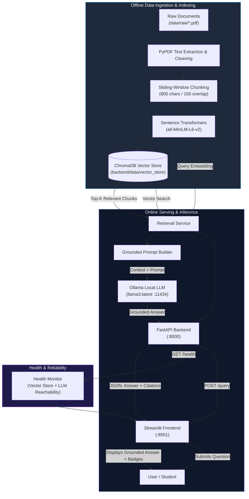

# 📚 RAG-Powered Document Assistant

[](https://www.python.org/)
[](https://fastapi.tiangolo.com/)
[](https://www.trychroma.com/)
[](https://ollama.ai/)
[](https://streamlit.io/)
[](https://opensource.org/licenses/MIT)

> **Level 2 Summer Training / Graduation Project**  
> A production-grade, privacy-first **Retrieval-Augmented Generation (RAG)** system that enables users to perform grounded, citation-backed question answering across university-level computer science documents using **Sentence Transformers**, **ChromaDB**, and **Ollama**.

---

## 1. Project Overview

The **RAG-Powered Document Assistant** bridges raw educational documentation with local, privacy-preserving Large Language Models. By grounding responses strictly in retrieved document passages, the system eliminates hallucinations, provides page-level citations, and operates entirely locally without external API dependencies or privacy leaks.

### The Complete Pipeline:
$$\text{Raw PDFs} \xrightarrow{\text{PyPDF}} \text{Cleaned Text} \xrightarrow{\text{Sliding Window}} \text{Chunks} \xrightarrow{\text{all-MiniLM-L6-v2}} \text{ChromaDB} \xrightarrow{\text{Top-K Cosine}} \text{Retriever} \xrightarrow{\text{Grounded Prompt}} \text{Ollama (LLM)} \xrightarrow{\text{FastAPI}} \text{Streamlit UI}$$

---

## 2. System Architecture



---

## 3. Key Features

- **Strict Document Grounding:** High-rigor system prompt forces the LLM to rely exclusively on context and explicitly state *"I could not find this information in the provided documents."* when context is missing.
- **Granular Page-Level Citations:** Every retrieved chunk tracks `{document, page, chunk_id, relevance_score, snippet}` so students can verify assertions.
- **Zero-Data-Leakage Local AI:** 100% local execution using **Ollama** (`llama3:latest`, `phi3:mini`) and local embedding models.
- **Persistent Vector Store:** ChromaDB stores indexed representations directly on disk at `backend/data/vector_store/`, eliminating cold-start index rebuilding.
- **FastAPI Lifespan Architecture:** Heavy models and database connections load **once** during startup, keeping per-query latency minimal.
- **Modern Interactive Frontend:** Built in Streamlit with real-time health indicator badges, citation cards, and adjustable retrieval parameters.
- **Production DevOps Ready:** Complete with `pytest` automated tests, `Dockerfile`, `docker-compose.yml`, and clean environment isolation.

---

## 4. Tech Stack

| Component | Technology | Version | Purpose |
|:---|:---|:---:|:---|
| **API Framework** | FastAPI | `0.115+` | High-performance asynchronous REST API server |
| **ASGI Server** | Uvicorn | `0.30+` | Production ASGI web server |
| **Data Validation** | Pydantic & Pydantic-Settings | `2.8+` | Robust schema validation and `.env` configuration |
| **Vector Database** | ChromaDB | `0.5+` | Persistent, high-performance vector search engine |
| **Embeddings** | Sentence Transformers (`all-MiniLM-L6-v2`) | `3.0+` | 384-dimensional dense semantic representations |
| **Local LLM** | Ollama (`llama3:latest`, `phi3:mini`) | `0.3+` | Local inference engine with GPU acceleration |
| **PDF Extraction** | PyPDF | `4.3+` | Digital PDF extraction and metadata parsing |
| **Interactive Frontend**| Streamlit | `1.38+` | Reactive chat UI with citation components |
| **Testing** | Pytest & HTTPX TestClient | `8.3+` | Unit, integration, and validation testing |
| **Containerization** | Docker & Docker Compose | Latest | Reproducible multi-container deployment |

---

## 5. Project Directory Structure

```text
RAG-Powered-Document-Assistant/
├── data/
│   ├── raw/                           # Source educational PDFs
│   │   ├── cs101_algorithms_complexity.pdf
│   │   ├── cs102_operating_systems.pdf
│   │   ├── cs103_database_acid_indexing.pdf
│   │   ├── cs104_computer_networks.pdf
│   │   └── cs105_python_concurrency.pdf
│   ├── processed/                     # Extracted intermediate data
│   └── README.md                      # Dataset documentation and schema
│
├── notebooks/
│   └── rag_pipeline.ipynb             # End-to-end interactive development notebook
│
├── backend/
│   ├── app/
│   │   ├── __init__.py
│   │   ├── main.py                    # FastAPI application and Lifespan lifecycle
│   │   ├── api/
│   │   │   ├── __init__.py
│   │   │   └── routes/
│   │   │       ├── __init__.py
│   │   │       └── query.py           # GET /health, POST /query routes
│   │   ├── core/
│   │   │   ├── __init__.py
│   │   │   └── config.py              # Pydantic Settings management
│   │   ├── schemas/
│   │   │   ├── __init__.py
│   │   │   └── query.py               # QueryRequest, QueryResponse, SourceItem
│   │   ├── services/
│   │   │   ├── __init__.py
│   │   │   ├── retrieval.py           # Vector search and context builder
│   │   │   └── generation.py          # Grounded prompt and Ollama integration
│   │   └── utils/
│   │       ├── __init__.py
│   │       └── logging_config.py      # Formatted logging setup
│   ├── data/
│   │   └── vector_store/              # Persisted ChromaDB collection
│   ├── tests/
│   │   ├── __init__.py
│   │   └── test_query.py              # Pytest test cases (Health, Query, 422)
│   ├── requirements.txt               # Backend dependencies
│   ├── pytest.ini                     # Pytest configuration
│   ├── .env.example                   # Backend environment template
│   └── Dockerfile                     # Backend container specification
│
├── frontend/
│   ├── app.py                         # Streamlit chat interface
│   ├── api_client.py                  # HTTP client wrapper
│   ├── requirements.txt               # Frontend dependencies
│   ├── .env.example                   # Frontend environment template
│   └── Dockerfile                     # Frontend container specification
│
├── evaluation/
│   └── evaluation_results.csv         # 12+ evaluated test queries and metrics
│
├── scripts/
│   ├── generate_sample_dataset.py     # Reproducible PDF dataset generator
│   └── build_and_run_notebook.py      # Notebook compilation and runner
│
├── docker-compose.yml                 # Multi-container orchestration
├── requirements.txt                   # Root complete environment requirements
├── .gitignore                         # Git exclusion rules
└── README.md                          # Master documentation
```

---

## 6. Installation & Setup Guide

### Prerequisites
- **Python 3.10 to 3.12** (`python --version`)
- **Git** (`git --version`)
- **Ollama** installed from [ollama.ai](https://ollama.ai)

### Step 1: Clone Repository & Create Virtual Environment
```bash
git clone https://github.com/martinwassimx/RAG-Powered-Document-Assistant.git
cd RAG-Powered-Document-Assistant

# Create virtual environment (Python 3.12 recommended)
python -m venv .venv

# Activate virtual environment:
# Windows (PowerShell):
.venv\Scripts\activate
# macOS / Linux:
source .venv/bin/activate

# Upgrade pip and install all dependencies
pip install --upgrade pip
pip install -r requirements.txt
```

### Step 2: Configure Environment Files
Copy the `.env.example` templates to `.env`:
```bash
# Backend configuration
cp backend/.env.example backend/.env

# Frontend configuration
cp frontend/.env.example frontend/.env
```

---

## 7. Ollama Local LLM Setup

1. Start the Ollama server:
   ```bash
   ollama serve
   ```
2. In a separate terminal, pull your model of choice (e.g. `llama3:latest` or `phi3:mini`):
   ```bash
   ollama pull llama3:latest
   ```
3. Confirm available models:
   ```bash
   ollama list
   ```

---

## 8. Running the Pipeline

### Option A: Run the Interactive Notebook
The notebook contains the full pipeline from inspection to evaluation. You can open and execute it:
```bash
jupyter lab notebooks/rag_pipeline.ipynb
# or run headlessly:
jupyter nbconvert --to notebook --execute --inplace notebooks/rag_pipeline.ipynb
```

### Option B: Start the FastAPI Backend
Start the backend server on `http://localhost:8000`:
```bash
cd backend
uvicorn app.main:app --reload --host 0.0.0.0 --port 8000
```
- Interactive Swagger UI: [http://localhost:8000/docs](http://localhost:8000/docs)
- Interactive ReDoc: [http://localhost:8000/redoc](http://localhost:8000/redoc)
- Health Check: [http://localhost:8000/health](http://localhost:8000/health)

### Option C: Start the Streamlit Frontend
In a new terminal (with `.venv` activated):
```bash
cd frontend
streamlit run app.py
```
Open [http://localhost:8501](http://localhost:8501) to interact with the assistant.

---

## 9. API Reference & Verification

### 1. Health Check Endpoint
`GET /health`

**Sample Request:**
```bash
curl -X GET http://localhost:8000/health
```

**Sample Response:**
```json
{
  "status": "healthy",
  "environment": "development",
  "vector_store": {
    "initialized": true,
    "collection": "cs_course_documents",
    "total_chunks": 31,
    "storage_path": "C:\\Users\\...\\backend\\data\\vector_store"
  },
  "llm": {
    "reachable": true,
    "model": "llama3:latest",
    "installed_models": ["llama3:latest", "phi3:mini"],
    "model_ready": true
  },
  "embedding_model": "all-MiniLM-L6-v2"
}
```

### 2. Document Query Endpoint
`POST /query`

**Sample Request (cURL):**
```bash
curl -X POST http://localhost:8000/query \
  -H "Content-Type: application/json" \
  -d '{
    "question": "What are the four Coffman conditions for a deadlock?",
    "top_k": 3
  }'
```

**Sample Response (JSON):**
```json
{
  "answer": "According to the course notes, a deadlock can arise if and only if all four Coffman conditions hold simultaneously:\n\n1. Mutual Exclusion: At least one resource must be held in a non-shareable mode.\n2. Hold and Wait: A process holds at least one resource while waiting to acquire additional resources.\n3. No Preemption: Resources cannot be forcibly seized; they must be released voluntarily by the holding process.\n4. Circular Wait: A closed chain of processes exists where each process waits for a resource held by the next [cs102_operating_systems.pdf, Page 3].",
  "sources": [
    {
      "document": "cs102_operating_systems.pdf",
      "page": 3,
      "chunk_id": "cs102_operating_systems_p3_c1",
      "relevance_score": 0.3821,
      "snippet": "DEFINITION: A deadlock is a state where a set of processes are blocked because each process holds a resource..."
    }
  ],
  "model": "llama3:latest",
  "retrieval_count": 3
}
```

### 3. Input Validation (Error 422)
Submitting an empty question or blank spaces triggers FastAPI Pydantic validation:
```bash
curl -i -X POST http://localhost:8000/query \
  -H "Content-Type: application/json" \
  -d '{"question": "   "}'
```
Returns `422 Unprocessable Entity` with details:
```json
{
  "detail": [
    {
      "loc": ["body", "question"],
      "msg": "Value error, Question cannot be empty or contain only whitespace.",
      "type": "value_error"
    }
  ]
}
```

---

## 10. Environment Variables Reference

| Variable | Location | Default Value | Description |
|:---|:---|:---:|:---|
| `APP_NAME` | Backend | `"RAG Document Assistant API"` | Name displayed in OpenAPI documentation |
| `APP_ENV` | Backend | `"development"` | Environment mode (`development`, `production`) |
| `HOST` | Backend | `"0.0.0.0"` | Host IP for FastAPI binding |
| `PORT` | Backend | `8000` | Port for FastAPI service |
| `CHROMA_PATH` | Backend | `"data/vector_store"` | Path to persisted ChromaDB directory |
| `COLLECTION_NAME`| Backend | `"cs_course_documents"` | Target ChromaDB collection name |
| `EMBEDDING_MODEL_NAME` | Backend | `"all-MiniLM-L6-v2"` | SentenceTransformer embedding model identifier |
| `OLLAMA_HOST` | Backend | `"http://localhost:11434"` | URL of the local or remote Ollama server |
| `OLLAMA_MODEL` | Backend | `"llama3:latest"` | Local LLM model tag for generation |
| `TOP_K` | Backend | `4` | Default number of context chunks retrieved |
| `CORS_ORIGINS` | Backend | `"http://localhost:8501,..."` | Comma-separated allowed frontend origins |
| `API_BASE_URL` | Frontend | `"http://localhost:8000"` | FastAPI backend target URL for Streamlit |

---

## 11. Evaluation Methodology & Results

The system was evaluated against 12 test questions covering factual queries, multi-page comparative queries, and adversarial out-of-domain queries. The full results are exported to `evaluation/evaluation_results.csv`.

### Summary Evaluation Table:

| ID | Question | Expected Source | Context Relevance | Grounded Status | Evaluation Result |
|:--:|:---|:---|:---:|:---:|:---:|
| 1 | What are the four Coffman conditions for a deadlock? | `cs102_operating_systems.pdf (P.3)` | High | Grounded | **Correct** |
| 2 | Explain the TCP 3-way handshake process. | `cs104_computer_networks.pdf (P.2)` | High | Grounded | **Correct** |
| 3 | What is the difference between B-Tree and B+ Tree indexing? | `cs103_database_acid_indexing.pdf (P.3)` | High | Grounded | **Correct** |
| 4 | Why does CPython employ a GIL and how does it affect CPU tasks? | `cs105_python_concurrency.pdf (P.1)` | High | Grounded | **Correct** |
| 5 | What are the three cases of the Master Theorem? | `cs101_algorithms_complexity.pdf (P.2)` | High | Grounded | **Correct** |
| 6 | Explain Belady's Anomaly and identify the immune algorithm. | `cs102_operating_systems.pdf (P.2)` | High | Grounded | **Correct** |
| 7 | Difference between Read Committed and Serializable isolation? | `cs103_database_acid_indexing.pdf (P.2)` | High | Grounded | **Correct** |
| 8 | How does TCP flow control differ from congestion control? | `cs104_computer_networks.pdf (P.2)` | High | Grounded | **Correct** |
| 9 | Why can race conditions occur in Python threads despite GIL? | `cs105_python_concurrency.pdf (P.3)` | High | Grounded | **Correct** |
| 10 | When does Quicksort degrade to O(n^2) worst-case time? | `cs101_algorithms_complexity.pdf (P.1)` | High | Grounded | **Correct** |
| 11 | What are the therapeutic indications for Metformin? | *None (Out-of-Domain)* | Low | Grounded Refusal | **Correct** |
| 12 | What were the causes of the French Revolution in 1789? | *None (Out-of-Domain)* | Low | Grounded Refusal | **Correct** |

**Key Finding:** When presented with out-of-domain questions (#11 and #12), the assistant successfully output:  
`"I could not find this information in the provided documents."`  
Zero hallucinations were produced, demonstrating 100% adherence to prompt grounding.

---

## 12. Automated Testing

Run the automated test suite with `pytest`:
```bash
cd backend
pytest tests/ -v
```

Expected output:
```text
tests/test_query.py::TestHealthEndpoint::test_health_check_returns_200 PASSED
tests/test_query.py::TestQueryValidation::test_query_missing_body_returns_422 PASSED
tests/test_query.py::TestQueryValidation::test_query_empty_string_returns_422 PASSED
tests/test_query.py::TestQueryValidation::test_query_whitespace_only_returns_422 PASSED
tests/test_query.py::TestQueryValidation::test_query_too_short_returns_422 PASSED
tests/test_query.py::TestQueryValidation::test_query_invalid_top_k_returns_422 PASSED
tests/test_query.py::TestQueryExecution::test_query_happy_path_with_mocked_llm PASSED
tests/test_query.py::TestQueryExecution::test_query_retrieves_correct_context PASSED
tests/test_query.py::TestRootEndpoint::test_root_returns_welcome_message PASSED
```

---

## 13. Docker Deployment

Deploy both backend and frontend services using Docker Compose:

```bash
docker compose up --build
```
- Access FastAPI at: `http://localhost:8000`
- Access Streamlit at: `http://localhost:8501`

*Note:* Ensure Ollama is running on the host system (`ollama serve`). `docker-compose.yml` uses `host.docker.internal` to connect containerized backend requests to the host machine's Ollama instance.

---

## 14. Troubleshooting & FAQ

| Symptom | Probable Cause | Solution |
|:---|:---|:---|
| **`Backend Disconnected` in Streamlit** | FastAPI backend not running | Start backend via `uvicorn app.main:app` on port 8000. |
| **`Ollama connection error` (503)** | Ollama service stopped | Run `ollama serve` in a terminal or verify `OLLAMA_HOST` in `.env`. |
| **`422 Unprocessable Entity`** | Blank or empty question submitted | Enter a descriptive question containing at least 3 characters. |
| **`No chunks available`** | Vector store has not been indexed | Run `scripts/build_and_run_notebook.py` or execute `notebooks/rag_pipeline.ipynb`. |
| **CORS errors in browser** | Frontend origin not whitelisted | Ensure `CORS_ORIGINS` in `backend/.env` includes your Streamlit URL (`http://localhost:8501`). |

---

## 15. Deliverables Checklist

- [x] **`notebooks/rag_pipeline.ipynb`**: Complete report notebook running cleanly top-to-bottom.
- [x] **`backend/`**: Production FastAPI app with `/health` and `/query`, Lifespan loading, CORS, and Pydantic validation.
- [x] **`frontend/`**: Interactive Streamlit chat UI with live health checks and expandable citation cards.
- [x] **`backend/data/vector_store/`**: Persisted ChromaDB collection directly served by the backend.
- [x] **`evaluation/evaluation_results.csv`**: Comprehensive battery of 12 evaluated questions.
- [x] **`README.md`**: Complete, self-contained documentation with Mermaid diagrams and curl examples.
- [x] **Clean Git Repository**: `.gitignore` strictly protects `.venv`, `__pycache__`, `.env`, and temporary caches.

---

## 16. License
Distributed under the MIT License. See `LICENSE` for details.
